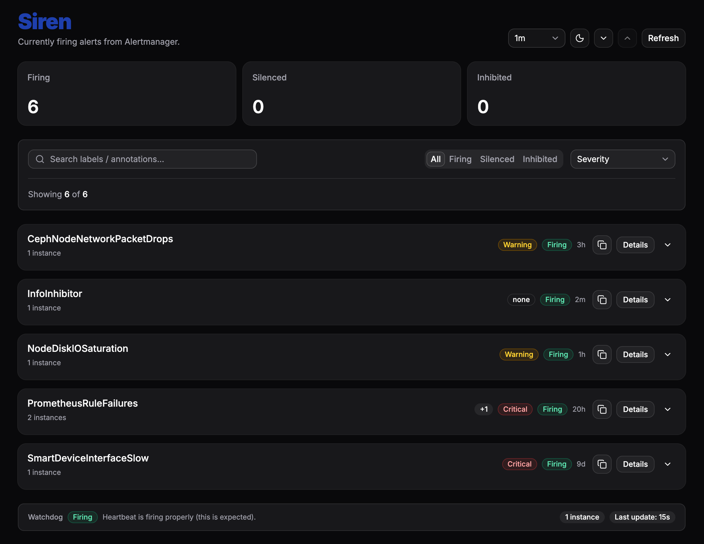
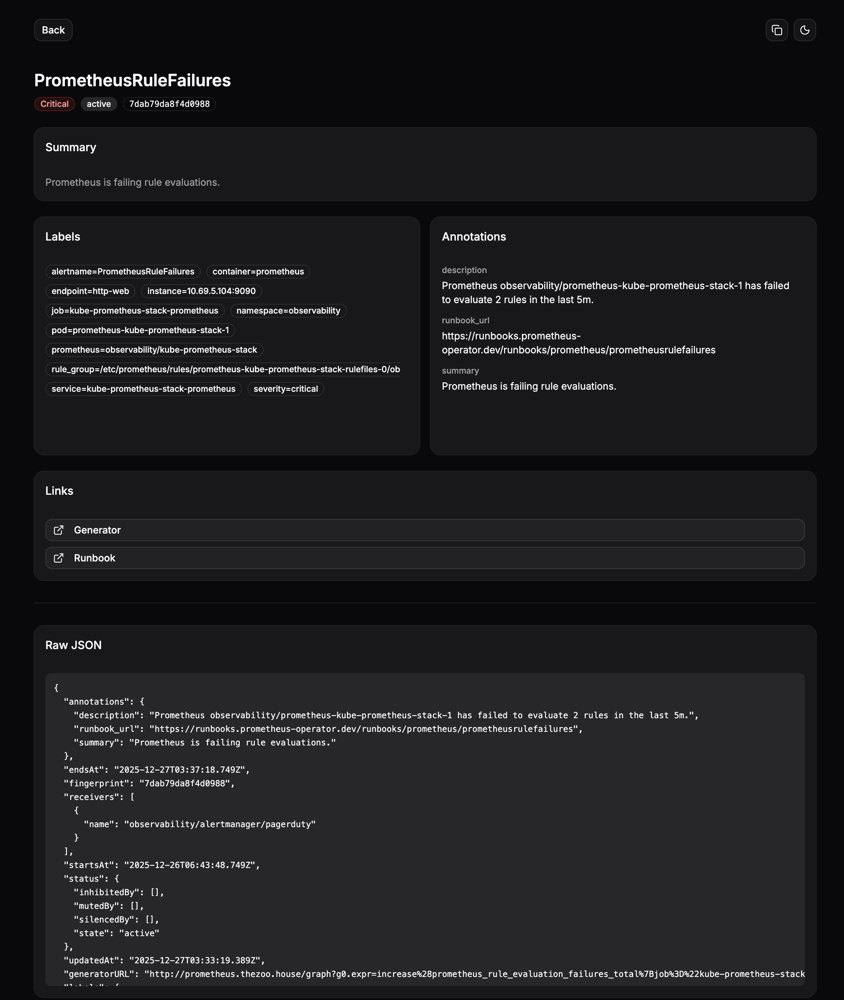

<div align="center">
  
  <h1>Siren</h1>
</div>

A clean, modern dashboard for browsing currently firing Alertmanager alerts with stable deep links to individual alerts.

## App previews

### Main page

<div align="center">
  
</div>

### Detailed view

<div align="center">
  
</div>

## Features

- **Real-time alert browsing** - View all currently firing alerts from Alertmanager
- **Auto-refresh** - Configurable refresh intervals (10s, 30s, 1m, 5m, or off)
- **Smart filtering** - Filter by severity, state (firing/silenced/inhibited), and search across alert labels
- **Alert grouping** - Alerts are automatically grouped by alert name for easier navigation
- **Watchdog monitoring** - Visual status indicator for Alertmanager watchdog alerts
- **Deep links** - Stable URLs for each alert instance (`/a/<fingerprint>`) perfect for PagerDuty or notification templates
- **Dark mode** - Built-in theme toggle for light and dark modes
- **Responsive design** - Works seamlessly on desktop and mobile devices

## Configuration

Set the following environment variables:

- `ALERTMANAGER_BASE_URL` (required) - The Alertmanager base URL, reachable **from the server** running Siren
  - Example: `http://alertmanager.monitoring.svc:9093`
  - Must be an absolute URL
- `PORT` (optional) - The port Siren listens on (default: `3000`)

For local development, create a `.env` file in the repository root:

```bash
ALERTMANAGER_BASE_URL=http://alertmanager.monitoring.svc:9093
PORT=3000
```

## Running Locally

### Prerequisites

- [Bun](https://bun.sh) (latest version)

### Development

```bash
# Install dependencies
bun install

# Start the development server
bun dev
```

The app will be available at `http://localhost:3000`.

### Available Scripts

- `bun dev` - Start development server
- `bun build` - Build for production
- `bun preview` - Preview production build locally
- `bun test` - Run tests
- `bun test:watch` - Run tests in watch mode
- `bun test:coverage` - Run tests with coverage report
- `bun format:check` - Check code formatting
- `bun format:write` - Format code
- `bun lint` - Run linter
- `bun lint:fix` - Fix linting issues
- `bun typecheck` - Type check without emitting files

## Docker

### Build

```bash
docker build -t siren:latest .
```

### Run

```bash
docker run -p 3000:3000 \
  -e ALERTMANAGER_BASE_URL=http://alertmanager.monitoring.svc:9093 \
  siren:latest
```

## Kubernetes Health Probes

Siren exposes dedicated endpoints for Kubernetes liveness and readiness probes:

- **`/livez`** - Liveness probe endpoint (always returns `200 OK`)
- **`/readyz`** - Readiness probe endpoint (returns `200 OK` when ready, `503 Service Unavailable` when not)
- **`/healthz`** - Human-readable health status page (not intended for probes)

### Example Kubernetes Deployment

```yaml
apiVersion: apps/v1
kind: Deployment
metadata:
  name: siren
spec:
  template:
    spec:
      containers:
      - name: siren
        image: ghcr.io/shamubernetes/siren:latest
        env:
        - name: ALERTMANAGER_BASE_URL
          value: "http://alertmanager.monitoring.svc:9093"
        ports:
        - containerPort: 3000
        livenessProbe:
          httpGet:
            path: /livez
            port: 3000
          initialDelaySeconds: 10
          periodSeconds: 10
        readinessProbe:
          httpGet:
            path: /readyz
            port: 3000
          initialDelaySeconds: 5
          periodSeconds: 5
          failureThreshold: 3
```

The readiness probe checks:
- `ALERTMANAGER_BASE_URL` is configured and valid
- Alertmanager is reachable (with a 2-second timeout)

If either check fails, the probe returns `503` and Kubernetes will remove the pod from service endpoints until it becomes ready again.

## GitHub Container Registry (GHCR)

Images are automatically built and published to GHCR on pushes to `main` and on version tags (`v*`).

### Pull and Run

```bash
docker pull ghcr.io/shamubernetes/siren:latest
docker run -p 3000:3000 \
  -e ALERTMANAGER_BASE_URL=http://alertmanager.monitoring.svc:9093 \
  ghcr.io/shamubernetes/siren:latest
```

Available tags:

- `latest` - Latest build from `main` branch
- `v*` - Version tags (e.g., `v1.0.0`)

## Deep Links

Each alert instance has a stable URL that can be shared or embedded in notifications:

- Format: `/a/<fingerprint>`
- Example: `https://siren.example.com/a/abc123def456`

You can copy the link from the UI using the "Copy Link" button on any alert detail page.

### Using in Alertmanager Notifications

When templating Alertmanager notifications, the alert fingerprint is available per alert. For grouped notifications, you may want to include multiple links or link to `/alerts` instead.

Example Alertmanager notification template:

```yaml
# In your Alertmanager config
receivers:
  - name: 'pagerduty'
    pagerduty_configs:
      - service_key: 'your-service-key'
        description: '{{ .GroupLabels.alertname }}'
        details:
          alert_link: 'https://siren.example.com/a/{{ .Fingerprint }}'
          dashboard: 'https://siren.example.com/alerts'
```

## CI/CD

Pull requests must pass the following checks before merging (enforced via GitHub Actions):

- Formatting check (`bun run format:check`)
- Linting (`bun run lint`)
- Type checking (`bun run typecheck`)
- Tests (`bun test`)
- Docker build test (multi-platform)

See [`.github/workflows/ci.yml`](.github/workflows/ci.yml) for the full CI configuration.

### Enabling Branch Protection

1. Go to repository Settings → Branches
2. Add a branch protection rule for your default branch
3. Enable "Require status checks to pass before merging"
4. Select the `lint-and-check` job from the CI workflow

## Release Process

Releases are automated using [semantic-release](https://github.com/semantic-release/semantic-release). When commits are pushed to `main`, semantic-release:

1. Analyzes commits to determine the next version
2. Generates release notes from commit messages
3. Creates a git tag (e.g., `v1.0.0`)
4. Publishes a GitHub release
5. Triggers Docker image build and push to GHCR

See [`.github/workflows/release.yml`](.github/workflows/release.yml) for the release workflow configuration.

## Technology Stack

- [TanStack Start](https://tanstack.com/start) - Full-stack React framework
- [TanStack Router](https://tanstack.com/router) - Type-safe routing
- [React](https://react.dev) - UI library
- [TypeScript](https://www.typescriptlang.org) - Type safety
- [Tailwind CSS](https://tailwindcss.com) - Styling
- [shadcn/ui](https://ui.shadcn.com) - UI components
- [Bun](https://bun.sh) - Runtime and package manager
- [Vitest](https://vitest.dev) - Testing framework

## License

[GNU General Public License v3.0](LICENSE)
